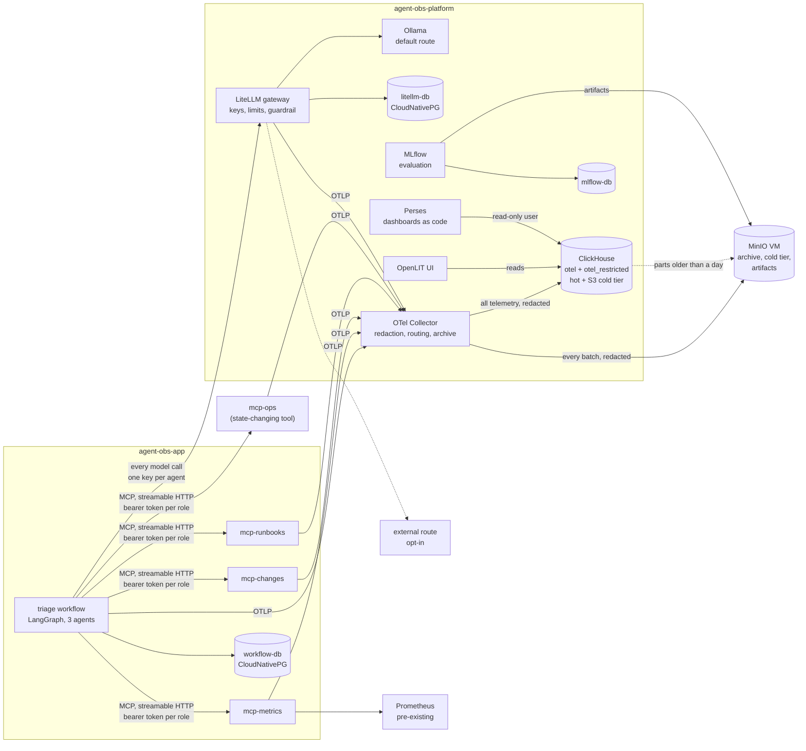

# Enterprise Agent Observability & Governance Lab

> **Status: concluded 2026-10-08.** The stack stays pinned to the versions it was tested
> with and is not tracked further. [Where it ended](#where-it-ended) has the findings;
> [Limitations and alternatives](docs/alternatives.md) says what fell short, what has
> moved in the ecosystem since, and what to weigh instead of copying this stack.

A self-hosted playground and a guide. A small multi-agent workflow, four MCP tool servers
and a model gateway, instrumented end to end with the OpenTelemetry GenAI semantic
conventions on Kubernetes, built to work out one pattern: how an enterprise that cannot
store prompt content can still see, govern and audit what its agents do.

It is written for practitioners who will run it themselves. Every chapter of the
[guide](docs/guide/README.md) is one experiment: the question, what to run, what to look
at, what you should see, what it means, and where the tooling falls short. The findings
and the upstream gaps are the product. The workflow is the specimen.

## Why I built this

I started getting the same set of questions more and more often as our conversations with customers moved into **agentic AI deployments** in their enterprises. Whether they were building their own agents or using ready-made platforms, everyone was running into the same tension:

- They wanted agents to be **productive and adaptive**.
- But they also needed to be able to answer, months later:
  1. **What did the agent do?**
  2. **On whose behalf?**
  3. **With what data access?**
  4. **Can you prove it later?**

And in many of these organisations — especially in regulated industries — they **cannot store prompt or completion content** in logs or traces because of PII, PHI, IP, or classification rules.

Sandboxing agents and implementing end-to-end controls with permissions helps, but only up to a point. The hard-to-track issues require more than just blocking requests or allowing access to certain data. I needed a way to provide a **full lineage** from where agents started to diverge from their tasks (or took paths they shouldn't have), without creating a compliance problem by storing the actual content.

## The problem I was trying to solve

In the deployments these conversations are about, thousands of agents across hundreds
of connection points rather than a lab like this one, you must be able to:

- Track **individual agents with immutable identities**.
- Then **trace** what each agent did from the start of a task until completion (or termination).

In some industries more than others, personal and/or intellectual property (IP) information simply cannot be stored in logs or traces. Yet the ability to understand **what data is being read, generated, or provided** becomes critical — in some cases a legal necessity.

So I started with the simplest question and the most straightforward approach:

> How can I trace every action taken, every document read, and every decision made by an agent **without storing the prompt, context, and the response**?

And then:

- What is the right way to store this?
- What mechanisms should I use to connect multiple requests and tools to a single task?
- How can an organisation safely, securely, and confidently **monitor and have visibility** into what their agents are doing, and detect when any of them go down rogue paths?

## How I approached it (and what I'm not claiming)

I wanted to use the most common, standard **open-source frameworks** while implementing this lab. I'm not an expert in these tools; I'm learning as I go and leaning on my "AI friends" to help me understand and extend them.

The stack I landed on:

- **LangGraph** and the **Model Context Protocol** for the workflow and its tools.
  These are the specimen rather than the instrument: they decide what the agents do,
  not how any of it is observed.
- **LiteLLM** as an AI gateway to provide routing, logging, request limiting, and tracking, and to allow both local and remote API calls.
- **OpenTelemetry** and **OpenLIT** for observability orchestration inside the code.
- **MLflow** for evaluation.
- **Perses** for dashboards.
- **ClickHouse** and **MinIO** for storage.

Along the way, I discovered features missing in some of these tools (which I've logged separately). Instead of just working around them, I decided to treat those gaps as **contribution opportunities**. I'm not claiming deep expertise here; I'm trying to add or fix what's missing with help from AI-assisted development and the existing communities around these projects.

## Where it ended

**All three phases were built**: Phase 1, observable: one trace spans agent →
MCP tool → gateway → model and the layers reconcile. Phase 2, governable: identity on
every span, six enforced controls each leaving a span, redaction on the only write path,
a restricted store for flagged traces, an S3 archive and a cold tier. Phase 3, public:
four Perses dashboards as code with a trace view through the plugin this project
contributed upstream, an MLflow evaluation loop, and the [guide](docs/guide/README.md).

### The hypothesis, and where it held

The claim under test was that a platform can produce **audit-grade agent traces without
recording the content**. It held for three of the four questions in full and for the
fourth with two limits that are honest rather than fixable here. The
[governance matrix](docs/governance-matrix.md) has every sub-question; this is the
summary.

| Question | Answer at conclusion | What still reads "partial" |
| :- | :- | :- |
| What did the agent do? | Yes: which agents in what order, which tools, the model that actually served each call, tokens and reasoning per agent, outcome, duration, and whether it was repeated | The real model is under a vendor attribute, not the portable one (CONTRIBUTIONS 3); reasoning counts come from the client, not the gateway (9) |
| On whose behalf? | Yes, on every span, and enforced on a credential at the gateway and at each tool server, not on the span's word | The principal is asserted by the run, not derived from an authentication event |
| With what data access? | Yes for the tool, the resource, the decision, the model, the quota, the content posture and the network; the arguments stay out by design | The record is a resource identifier plus an argument hash, and a small argument space makes the hash reversible |
| Can you prove it later? | Yes: every run complete, reconciled across layers, content-free, routed and fingerprinted by one command; seven-year TTL on the cold tier; every batch in a versioned archive | The digest lives in a local file, not under object lock; log records and metrics are not covered |

**What worked, and why.** Almost everything that worked traces back to two decisions
made before anything was deployed. *One write path*: the Collector is the only route into
storage, so redaction, routing and retention had a place to be enforced. *Verify what is
stored*: every content claim is a grep over stored attributes, every completeness claim
is a count of spans whose parent never arrived, and every reconciliation is two sums that
must agree. Those two habits found the span leak that made a 76-span trace look complete,
the guardrail that put full prompts on a `no_content` gateway, and the tail-sampling
window that could not outlast an agent run. Trace context crossed both hops without a
line of propagation code, because the gateway joins an incoming trace and the `mcp` SDK
carries context in JSON-RPC `_meta`. Identity as baggage for attribution and a credential
for enforcement, denials recorded as spans rather than raised as errors, and the receipt
as one command a reviewer runs without the author, all did what they were built to do.

**What did not, and it was nearly always the same failure.** Nothing failed loudly. The
failures were confident, plausible, wrong answers from components that were otherwise
working: doubled token counts, a leaked span, a reasoning model truncating mid-thought
and the next agent treating the fragment as an answer, a UI reading zero for a compliant
producer, and on the last day a run whose three agents all read `ok` while its answer
was wrong. The outcome column measures the machinery; whether the answer was right is a
different question with a different instrument, which is why evaluation is scored
separately and why this guide keeps the two apart.

### Where the gaps were, and what to weigh instead

Each row is a gap this lab hit, what it did about it, and the alternative a reader should
weigh. The long form, with what has moved in the ecosystem since and the trade-offs, is
[docs/alternatives.md](docs/alternatives.md).

| Layer | Gap found here | What the lab did | Alternative to weigh |
| :- | :- | :- | :- |
| Trace view over ClickHouse | Perses had no trace query for its ClickHouse datasource, so the Gantt and trace panels had nothing to read | Wrote the plugin ([perses/plugins#813](https://github.com/perses/plugins/pull/813), open, three review rounds applied) and built the Perses image from the PR head | Grafana's ClickHouse data source reads `otel_traces` with a built-in trace view; a ClickHouse-native UI over the same tables; Jaeger v2, whose ClickHouse storage is stable since v2.21 but uses its own schema; Tempo only if trace-ID lookup is all that is needed |
| GenAI UI and SDK | OpenLIT's UI read pre-convention names and showed zero tokens, its logs tab shipped broken, its SDK captured content by default and leaked the agent → model span | Guarded the leak locally, read ClickHouse directly, moved the daily view to Perses | A library-only instrumentation, or the upstream OpenTelemetry instrumentations as they mature; a UI chosen for its licence and its behaviour under a no-content posture |
| Model gateway | The portable model attribute carried the routing alias, no reasoning tokens, a guardrail that returned a 500 with no span, and a guardrail record that leaked full prompts past `no_content`. And a limit of the lab, not the tool: the agents call the tool servers directly, so the gateway saw model calls only | Read the vendor attribute, wrapped the guardrail correctly, caught the leak with redaction on the pipeline. Never evaluated the MCP gateway and A2A endpoints that LiteLLM v1.100.0 already ships | Route tool calls through a gateway too: the MCP endpoint of the gateway already deployed, or one built for MCP and agent traffic. Keep the pipeline control whichever is chosen |
| Tool authorization | Static bearer tokens and a ConfigMap policy; identity in baggage is an assertion; no convention for a decision | Enforced on the credential, recorded the decision on the server's span under local names | MCP's 2026-07-28 OAuth 2.1 model, an MCP gateway (LiteLLM's own, or a dedicated one), a policy engine, a workload identity |
| Conventions | No vocabulary for a handoff, an outcome, an authorization decision or a non-content data-access record; client and gateway spans double-count | Standard names where they exist, local names flagged as local | Track the GenAI conventions, still in Development with no release; A2A gives a handoff a protocol and so a span |
| Runtime | No isolation; identity is a string the Job was given; k3s leaves a pod's first seconds unpoliced | Out of scope by design: visibility, not confinement | Agent Sandbox for an identity and an isolation boundary the spans can carry; Agent Substrate above it for scheduling; neither does observability, so the questions still have to be answered |
| Restricted store | Tail sampling decides at a fixed offset from a trace's first span, and an agent run outlives any window | Promotion after the trace is quiet, which made the Collector no longer the sole writer | Row policies on one table; a second pipeline keyed on a trace-level flag |
| Content control | A deny-list of nine key patterns is a list someone maintains, and new content paths arrive with features | Masked by key pattern, recorded what was masked | An allow-list enforced by the pipeline and by the table schema; classification at the emitter |
| Evaluation | Rule-based scores cannot judge relevance; the local 3B model was wrong while every outcome read `ok` | Kept small, scored separately in MLflow, joined on the trace id | An LLM judge from the start, on the same join |

**Upstream.** The fourteen gaps this produced are in [CONTRIBUTIONS.md](CONTRIBUTIONS.md),
each verified at the versions in the stack table below. One is a pull request this lab
runs; the other thirteen are recorded and were not filed, may have been fixed since, and
are open to anyone to file. Every finding along the way, in order and with the failures
kept in, is in `LEARNINGS.md`, the author's working log, which stays private; references
to it throughout this repository point there deliberately.

The commands run on either of two environments, and everything that differs between them
lives in `.env`: the three-node k3s cluster the guide was first built on, or a single VM
on a Proxmox host that `make cluster` builds from a cloud-init template and equips with
the Gateway, CloudNativePG and Prometheus the manifests expect. The
[lab environment](docs/lab-environment.md) page lists both.

## How to use this repository

| If you want to | Go to |
| :- | :- |
| Understand the stack and how the pieces relate | [Chapter 0](docs/guide/00-the-stack.md) |
| Run the experiments in order | [The guide](docs/guide/README.md) |
| Check a deployment against the four questions | [Governance matrix](docs/governance-matrix.md) |
| See what was found in the upstream tools | [CONTRIBUTIONS.md](CONTRIBUTIONS.md) |
| Build it on this lab | [Lab environment](docs/lab-environment.md) and `make help` |
| See every decision and its alternative | [Decisions](docs/decisions.md) |
| Weigh this stack against what exists now | [Limitations and alternatives](docs/alternatives.md) |
| Look at it: four UIs | OpenLIT (per-trace GenAI view), LiteLLM (keys, teams, guardrails), Perses (the dashboards and trace view), MLflow (evaluation runs). Hostnames in the [lab environment](docs/lab-environment.md) page |

## What this deliberately is not

- **Not a product.** The workflow is a vehicle for telemetry. Model quality is not what is
  being demonstrated, and a 3B model on CPU is the default.
- **Not dependent on anything hosted.** The default model route is a self-hosted Ollama.
  An external OpenAI-compatible route is opt-in, added only when a key is present in `.env`.
- **Not a sandbox.** Nothing here isolates execution. The subject is visibility, attribution
  and access control, not confinement. Agent Sandbox and Agent Substrate are where that
  work went in 2026; the [alternatives](docs/alternatives.md) page says what they change.
- **Not airtight.** Reasonably secure and fully auditable, not hardened against a determined
  adversary.
- **Not a production observability platform.** Single-node ClickHouse, node-pinned volumes,
  a lab's worth of hygiene. Where that would not do in an enterprise, the guide says so.
- **No Tempo, Grafana or LangFlow**, by choice. ClickHouse is the trace store, OpenLIT the
  per-trace UI, Perses the dashboards, MLflow the evaluation loop. What each exclusion
  cost, and what it would have saved, is on the [alternatives](docs/alternatives.md) page.


## Architecture



Two components are control points, and they do different jobs. **The gateway enforces at
the boundary**, before a model call happens. **The Collector processes after the fact**,
before anything is stored. Everything else produces or carries telemetry.

The properties that matter, each established in LEARNINGS.md rather than assumed:

- **Everything reaches storage through the Collector's redaction.** It is the only
  writer of telemetry, and OpenLIT reads `otel_traces` with its bundled ClickHouse and
  collector disabled. One other thing writes: `make restricted-promote` copies flagged
  traces — already stored, already redacted — into the restricted database, because a
  tail-sampling window cannot span an agent run (LEARNINGS.md, 2026-09-27).
- **Every model call goes through the gateway.** The workflow names a route (`local`,
  `remote`), never a model, so the gateway is the one place model access can be observed
  and, later, governed.
- **Trace context crosses the agent → tool boundary** because the `mcp` 2.x SDK carries
  W3C `traceparent` inside the JSON-RPC `_meta` field (SEP-414) on every request. It is a
  property of the SDK, not the transport: stdio carries it too, and a client that does not
  implement it drops the trail on any transport. The tool servers warn when that happens.
- **Content capture is off at every layer, explicitly, and verified by probes** that grep
  the stored attributes for the prompt text. The gateway runs with `no_content`. The
  workflow and tool servers set `capture_message_content=False`, because the OpenLIT SDK
  defaults it to `True`.
- **Attribution is per agent.** Each agent node records its own token usage (reasoning
  included), model-call count, finish reasons and a `denied` / `truncated` / `empty` /
  `degraded` / `ok` outcome on its own span.
- **Identity is on every span, and enforcement is on credentials.** The principal and the
  agent travel as baggage; the gateway enforces on a per-agent virtual key and the tool
  servers on a per-role bearer token, and every decision is an attribute on the span
  where it was made.
- **Content cannot reach storage even when a component emits it.** The Collector's
  redaction masks nine key patterns on spans and log records, and the spans say what was
  masked. This caught LiteLLM's guardrail putting full prompts on a `no_content` gateway.

## Stack

| Layer | Component | Version |
| :- | :- | :- |
| Orchestration | LangGraph | 1.2.11 |
| Tools | MCP Python SDK, streamable HTTP | 2.2.0 |
| GenAI instrumentation | OpenLIT SDK | 1.45.0 |
| Model gateway | LiteLLM proxy | v1.100.0 |
| Default model | Ollama (CPU), `qwen2.5:3b` | 0.33.3 |
| Pipeline | OpenTelemetry Collector contrib | 0.159.0 (chart 0.172.1) |
| Hot store | ClickHouse | 25.8.33 |
| UI | OpenLIT | 1.24.0 |
| App state | PostgreSQL on CloudNativePG | 18.4 |
| Object storage | MinIO, standalone VM | RELEASE.2025-09-07T16-13-09Z |
| Dashboards | Perses, with the ClickHouse trace-query plugin from [perses/plugins#813](https://github.com/perses/plugins/pull/813) | v0.54.0 (chart 0.23.2) |
| Evaluation | MLflow | 3.16.0 (chart 1.11.7) |
| Runtime | Python | 3.12.14 |

## Running it

```bash
cp .env.example .env     # every value has a working default except optional external keys
make step1               # namespaces, secrets, ClickHouse, Collector, smoke trace
make step2               # OpenLIT UI
make step3               # Ollama and model pull, LiteLLM gateway and its database
make postgres            # the workflow's state
make step5               # build the MCP image, deploy the three tool servers, probe them
make workflow-image
make workflow-probe      # one-node plumbing proof
make workflow-triage     # a real run; INCIDENT= and ROUTE=local|remote override
make litellm-keys && make netpol             # chapters 6-7: identity, authorization
make ch-restricted-user && make retention    # chapter 8: restricted store, cold tier
make perses-image && make perses             # chapter 10: dashboards
make mlflow && make evaluate                 # chapter 11: evaluation
make demo-<name>                             # one control each; `make help` lists them
make receipt RUN=<run id>                    # chapter 9: the reviewer's receipt
```

Prerequisites, what is lab-specific, and how the UIs are reached:
[docs/lab-environment.md](docs/lab-environment.md). Deployment order and why it is
load-bearing: [deploy/README.md](deploy/README.md).

## Checking it

Each probe isolates one layer, so "which layer is it?" is answered in minutes.

| Command | Answers |
| :- | :- |
| `make smoke-trace` | Does the pipeline work, with no application involved? |
| `./scripts/gateway-trace.sh local` | Does the gateway join an incoming trace, and is content absent from every span? |
| `make mcp-probe` | Do the three evidence tool servers answer MCP? (`mcp-ops` is exercised by the authorization demos) |
| `make drift` | Does the cluster run what this repository describes? |
| `make demo-content-redacted` | With SDK content capture forced on, does any content reach the store? |
| `make receipt RUN=` | Is one run complete, reconciled, content-free, routed and fingerprinted? |

A trace is only complete if no span points at a parent that was never exported. This query
is what caught a span leak that dropped the link between every agent and its model calls:

```sql
SELECT count() FROM otel_traces
WHERE TraceId = '<trace id>' AND ParentSpanId != ''
  AND ParentSpanId NOT IN (SELECT SpanId FROM otel_traces WHERE TraceId = '<trace id>')
```

## Layout

```
docs/guide/     the guide, one experiment per chapter, in reading order
docs/           governance matrix, decisions, limitations and alternatives, this lab's environment, the runbooks the tool server searches
deploy/         numbered manifests and Helm values; the numbering is the deployment order
apps/workflow   the LangGraph triage workflow
apps/mcp        the four MCP tool servers (one image, four Deployments)
apps/perses     Perses with the contributed ClickHouse trace-query plugin
scripts/        build, tagging, probes, the receipt, the evaluation loop and the drift check
CONTRIBUTIONS.md  upstream gaps, and what was filed
TODO.md         what was still open at the conclusion
```

## Licence

[Apache 2.0](LICENSE).
