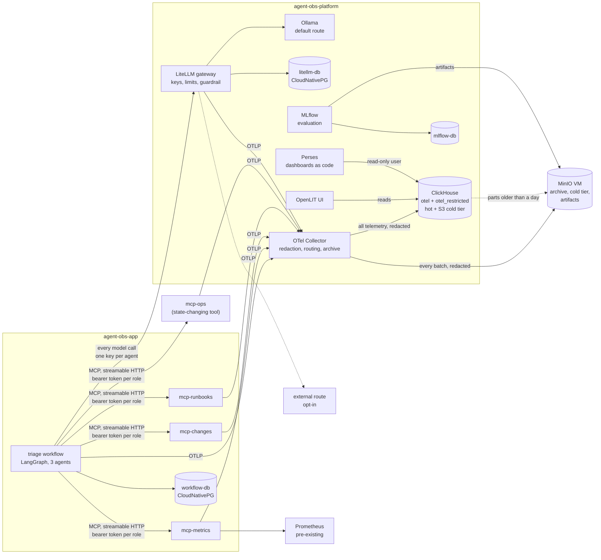

# Enterprise Agent Observability & Governance Lab

A self-hosted playground and a guide. A small multi-agent workflow, four MCP tool servers
and a model gateway, instrumented end to end with the OpenTelemetry GenAI semantic
conventions on Kubernetes, built to work out one pattern: how an enterprise that cannot
store prompt content can still see, govern and audit what its agents do.

It is written for practitioners who will run it themselves. Every chapter of the
[guide](docs/guide/README.md) is one experiment: the question, what to run, what to look
at, what you should see, what it means, and where the tooling falls short. The findings
and the upstream gaps are the product. The workflow is the specimen.

## Why I built this

I started getting the same set of questions more and more often as our conversations with customers moved into **agentic AI deployments** in their enterprises. Whether they were building their own agents or using ready-made platforms, everyone was running into the same tension:

- They wanted agents to be **productive and adaptive**.
- But they also needed to be able to answer, months later:
  1. **What did the agent do?**
  2. **On whose behalf?**
  3. **With what data access?**
  4. **Can you prove it later?**

And in many of these organisations — especially in regulated industries — they **cannot store prompt or completion content** in logs or traces because of PII, PHI, IP, or classification rules.

Sandboxing agents and implementing end-to-end controls with permissions helps, but only up to a point. The hard-to-track issues require more than just blocking requests or allowing access to certain data. I needed a way to provide a **full lineage** from where agents started to diverge from their tasks (or took paths they shouldn't have), without creating a compliance problem by storing the actual content.

## The problem I was trying to solve

In the deployments these conversations are about, thousands of agents across hundreds
of connection points rather than a lab like this one, you must be able to:

- Track **individual agents with immutable identities**.
- Then **trace** what each agent did from the start of a task until completion (or termination).

In some industries more than others, personal and/or intellectual property (IP) information simply cannot be stored in logs or traces. Yet the ability to understand **what data is being read, generated, or provided** becomes critical — in some cases a legal necessity.

So I started with the simplest question and the most straightforward approach:

> How can I trace every action taken, every document read, and every decision made by an agent **without storing the prompt, context, and the response**?

And then:

- What is the right way to store this?
- What mechanisms should I use to connect multiple requests and tools to a single task?
- How can an organisation safely, securely, and confidently **monitor and have visibility** into what their agents are doing, and detect when any of them go down rogue paths?

## How I approached it (and what I'm not claiming)

I wanted to use the most common, standard **open-source frameworks** while implementing this lab. I'm not an expert in these tools; I'm learning as I go and leaning on my "AI friends" to help me understand and extend them.

The stack I landed on:

- **LangGraph** and the **Model Context Protocol** for the workflow and its tools.
  These are the specimen rather than the instrument: they decide what the agents do,
  not how any of it is observed.
- **LiteLLM** as an AI gateway to provide routing, logging, request limiting, and tracking, and to allow both local and remote API calls.
- **OpenTelemetry** and **OpenLIT** for observability orchestration inside the code.
- **MLflow** for evaluation.
- **Perses** for dashboards.
- **ClickHouse** and **MinIO** for storage.

Along the way, I discovered features missing in some of these tools (which I've logged separately). Instead of just working around them, I decided to treat those gaps as **contribution opportunities**. I'm not claiming deep expertise here; I'm trying to add or fix what's missing with help from AI-assisted development and the existing communities around these projects.

## Where it stands

**All three phases are built.** Phase 1, observable: a complete trace spans agent → MCP
tool → gateway → model and the layers reconcile. Phase 2, governable: identity on every
span, six enforced controls each leaving a span, content redaction on the only write path,
a restricted store for flagged traces, an S3 archive and a cold tier. Phase 3, public:
four Perses dashboards as code with a trace view through the plugin this project
contributed upstream, an MLflow evaluation loop, and this guide. The
[governance matrix](docs/governance-matrix.md) says where each question stands, row by
row, including the two rows that remain "partial" by design.

The thirteen upstream gaps this produced are in [CONTRIBUTIONS.md](CONTRIBUTIONS.md), one
of them already a pull request that this lab now runs. Every finding along the way, in
order and with the failures kept in, is in `LEARNINGS.md` — the author's working log, which
stays private; references to it throughout this repository point there deliberately.

The commands assume [this lab's environment](docs/lab-environment.md), a three-node k3s
cluster with a few pre-existing pieces. A single-machine path is the next infrastructure
work, so that a reader can run the guide without a cluster.

## How to use this repository

| If you want to | Go to |
| :- | :- |
| Understand the stack and how the pieces relate | [Chapter 0](docs/guide/00-the-stack.md) |
| Run the experiments in order | [The guide](docs/guide/README.md) |
| Check a deployment against the four questions | [Governance matrix](docs/governance-matrix.md) |
| See what was found in the upstream tools | [CONTRIBUTIONS.md](CONTRIBUTIONS.md) |
| Build it on this lab | [Lab environment](docs/lab-environment.md) and `make help` |
| See every decision and its alternative | [Decisions](docs/decisions.md) |
| Look at it: four UIs | OpenLIT (per-trace GenAI view), LiteLLM (keys, teams, guardrails), Perses (the dashboards and trace view), MLflow (evaluation runs). Hostnames in the [lab environment](docs/lab-environment.md) page |

## What this deliberately is not

- **Not a product.** The workflow is a vehicle for telemetry. Model quality is not what is
  being demonstrated, and a 3B model on CPU is the default.
- **Not dependent on anything hosted.** The default model route is a self-hosted Ollama.
  An external OpenAI-compatible route is opt-in, added only when a key is present in `.env`.
- **Not a sandbox.** Nothing here isolates execution. The subject is visibility, attribution
  and access control, not confinement.
- **Not airtight.** Reasonably secure and fully auditable, not hardened against a determined
  adversary.
- **Not a production observability platform.** Single-node ClickHouse, node-pinned volumes,
  a lab's worth of hygiene. Where that would not do in an enterprise, the guide says so.
- **No Tempo, Grafana or LangFlow**, by choice. ClickHouse is the trace store, OpenLIT the
  per-trace UI, Perses the dashboards, MLflow the evaluation loop.


## Architecture



Two components are control points, and they do different jobs. **The gateway enforces at
the boundary**, before a model call happens. **The Collector processes after the fact**,
before anything is stored. Everything else produces or carries telemetry.

The properties that matter, each established in LEARNINGS.md rather than assumed:

- **Everything reaches storage through the Collector's redaction.** It is the only
  writer of telemetry, and OpenLIT reads `otel_traces` with its bundled ClickHouse and
  collector disabled. One other thing writes: `make restricted-promote` copies flagged
  traces — already stored, already redacted — into the restricted database, because a
  tail-sampling window cannot span an agent run (LEARNINGS.md, 2026-09-27).
- **Every model call goes through the gateway.** The workflow names a route (`local`,
  `remote`), never a model, so the gateway is the one place model access can be observed
  and, later, governed.
- **Trace context crosses the agent → tool boundary** because the `mcp` 2.x SDK carries
  W3C `traceparent` inside the JSON-RPC `_meta` field (SEP-414) on every request. It is a
  property of the SDK, not the transport: stdio carries it too, and a client that does not
  implement it drops the trail on any transport. The tool servers warn when that happens.
- **Content capture is off at every layer, explicitly, and verified by probes** that grep
  the stored attributes for the prompt text. The gateway runs with `no_content`. The
  workflow and tool servers set `capture_message_content=False`, because the OpenLIT SDK
  defaults it to `True`.
- **Attribution is per agent.** Each agent node records its own token usage (reasoning
  included), model-call count, finish reasons and a `denied` / `truncated` / `empty` /
  `degraded` / `ok` outcome on its own span.
- **Identity is on every span, and enforcement is on credentials.** The principal and the
  agent travel as baggage; the gateway enforces on a per-agent virtual key and the tool
  servers on a per-role bearer token, and every decision is an attribute on the span
  where it was made.
- **Content cannot reach storage even when a component emits it.** The Collector's
  redaction masks nine key patterns on spans and log records, and the spans say what was
  masked. This caught LiteLLM's guardrail putting full prompts on a `no_content` gateway.

## Stack

| Layer | Component | Version |
| :- | :- | :- |
| Orchestration | LangGraph | 1.2.11 |
| Tools | MCP Python SDK, streamable HTTP | 2.2.0 |
| GenAI instrumentation | OpenLIT SDK | 1.45.0 |
| Model gateway | LiteLLM proxy | v1.100.0 |
| Default model | Ollama (CPU), `qwen2.5:3b` | 0.33.3 |
| Pipeline | OpenTelemetry Collector contrib | 0.159.0 (chart 0.172.1) |
| Hot store | ClickHouse | 25.8.33 |
| UI | OpenLIT | 1.24.0 |
| App state | PostgreSQL on CloudNativePG | 18.4 |
| Object storage | MinIO, standalone VM | RELEASE.2025-09-07T16-13-09Z |
| Dashboards | Perses, with the ClickHouse trace-query plugin from [perses/plugins#813](https://github.com/perses/plugins/pull/813) | v0.54.0 (chart 0.23.2) |
| Evaluation | MLflow | 3.16.0 (chart 1.11.7) |
| Runtime | Python | 3.12.14 |

## Running it

```bash
cp .env.example .env     # every value has a working default except optional external keys
make step1               # namespaces, secrets, ClickHouse, Collector, smoke trace
make step2               # OpenLIT UI
make step3               # Ollama and model pull, LiteLLM gateway and its database
make postgres            # the workflow's state
make step5               # build the MCP image, deploy the three tool servers, probe them
make workflow-image
make workflow-probe      # one-node plumbing proof
make workflow-triage     # a real run; INCIDENT= and ROUTE=local|remote override
make litellm-keys && make netpol             # chapters 6-7: identity, authorization
make ch-restricted-user && make retention    # chapter 8: restricted store, cold tier
make perses-image && make perses             # chapter 10: dashboards
make mlflow && make evaluate                 # chapter 11: evaluation
make demo-<name>                             # one control each; `make help` lists them
make receipt RUN=<run id>                    # chapter 9: the reviewer's receipt
```

Prerequisites, what is lab-specific, and how the UIs are reached:
[docs/lab-environment.md](docs/lab-environment.md). Deployment order and why it is
load-bearing: [deploy/README.md](deploy/README.md).

## Checking it

Each probe isolates one layer, so "which layer is it?" is answered in minutes.

| Command | Answers |
| :- | :- |
| `make smoke-trace` | Does the pipeline work, with no application involved? |
| `./scripts/gateway-trace.sh local` | Does the gateway join an incoming trace, and is content absent from every span? |
| `make mcp-probe` | Do the three evidence tool servers answer MCP? (`mcp-ops` is exercised by the authorization demos) |
| `make drift` | Does the cluster run what this repository describes? |
| `make demo-content-redacted` | With SDK content capture forced on, does any content reach the store? |
| `make receipt RUN=` | Is one run complete, reconciled, content-free, routed and fingerprinted? |

A trace is only complete if no span points at a parent that was never exported. This query
is what caught a span leak that dropped the link between every agent and its model calls:

```sql
SELECT count() FROM otel_traces
WHERE TraceId = '<trace id>' AND ParentSpanId != ''
  AND ParentSpanId NOT IN (SELECT SpanId FROM otel_traces WHERE TraceId = '<trace id>')
```

## Layout

```
docs/guide/     the guide, one experiment per chapter, in reading order
docs/           governance matrix, decisions, this lab's environment, the runbooks the tool server searches
deploy/         numbered manifests and Helm values; the numbering is the deployment order
apps/workflow   the LangGraph triage workflow
apps/mcp        the four MCP tool servers (one image, four Deployments)
apps/perses     Perses with the contributed ClickHouse trace-query plugin
scripts/        build, tagging, probes, the receipt, the evaluation loop and the drift check
CONTRIBUTIONS.md  upstream gaps, and what was filed
TODO.md         deferred work
```

## Licence

[Apache 2.0](LICENSE).
