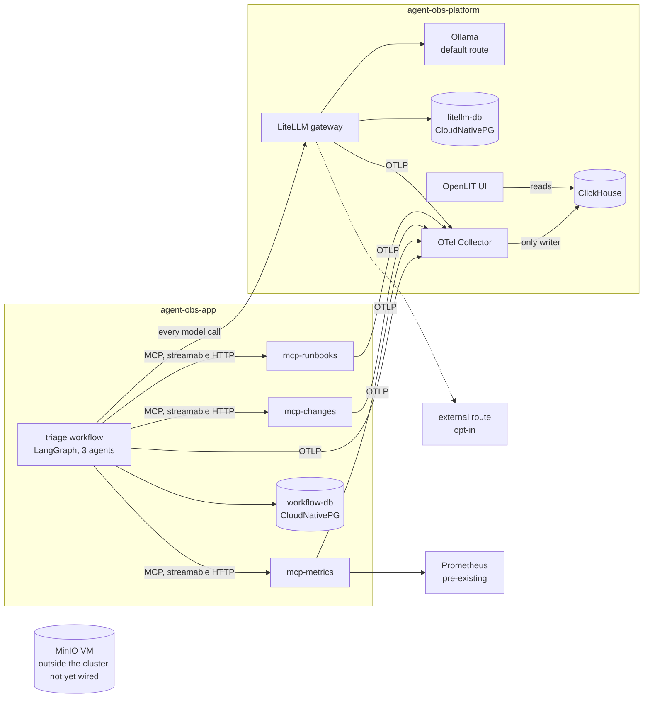

# Enterprise Agent Observability & Governance Lab

A self-hosted playground and a guide. A small multi-agent workflow, three MCP tool servers
and a model gateway, instrumented end to end with the OpenTelemetry GenAI semantic
conventions on Kubernetes, built to work out one pattern: how an enterprise that cannot
store prompt content can still see, govern and audit what its agents do.

It is written for practitioners who will run it themselves. Every chapter of the
[guide](docs/guide/README.md) is one experiment: the question, what to run, what to look
at, what you should see, what it means, and where the tooling falls short. The findings
and the upstream gaps are the product. The workflow is the specimen.

## Why this exists

<!-- TODO(human): the thesis, in your own words. See the "Learn by Doing" note in the
     session that created this file. Five to ten lines: who cannot log content and why,
     what they still have to answer, what the spec leaves to them, and what this lab
     sets out to show. This is the paragraph only you can write credibly. -->

## The four questions, and the claim

Regulated organisations often cannot store prompt or completion content, and still have
to answer, months later:

1. **What did the agent do?**
2. **On whose behalf?**
3. **With what data access?**
4. **Can you prove it later?**

The claim under test is that a platform can produce **audit-grade agent traces without
recording the content**. The [governance matrix](docs/governance-matrix.md) tracks each
question against the control that answers it, the evidence in the stored trace, and where
the answer is still "no".

## Where it stands

**Phase 1, "make it observable", is done.** A complete trace spans agent → MCP tool →
gateway → model, the layers reconcile with each other, and the images rebuild from the
repository. **Phase 2, "make it governable", is in progress**: identity and authorization
are built (chapters 6 and 7), with six controls each demonstrable by one make target and
each leaving a span. Content redaction, routing, retention and the reviewer's checks are
next. The matrix says where each question stands, row by row.

The commands assume [this lab's environment](docs/lab-environment.md), a three-node k3s
cluster with a few pre-existing pieces. A single-machine path is the next infrastructure
work, so that a reader can run the guide without a cluster.

## How to use this repository

| If you want to | Go to |
| :- | :- |
| Understand the stack and how the pieces relate | [Chapter 0](docs/guide/00-the-stack.md) |
| Run the experiments in order | [The guide](docs/guide/README.md) |
| Check a deployment against the four questions | [Governance matrix](docs/governance-matrix.md) |
| See what was found in the upstream tools | [CONTRIBUTIONS.md](CONTRIBUTIONS.md) |
| Read what happened, in order, failures included | [LEARNINGS.md](LEARNINGS.md) |
| Build it on this lab | [Lab environment](docs/lab-environment.md) and `make help` |

## What this deliberately is not

- **Not a product.** The workflow is a vehicle for telemetry. Model quality is not what is
  being demonstrated, and a 3B model on CPU is the default.
- **Not dependent on anything hosted.** The default model route is a self-hosted Ollama.
  An external OpenAI-compatible route is opt-in, added only when a key is present in `.env`.
- **Not a sandbox.** Nothing here isolates execution. The subject is visibility, attribution
  and access control, not confinement.
- **Not airtight.** Reasonably secure and fully auditable, not hardened against a determined
  adversary.
- **Not a production observability platform.** Single-node ClickHouse, node-pinned volumes,
  a lab's worth of hygiene. Where that would not do in an enterprise, the guide says so.
- **No Tempo, Grafana or LangFlow**, by choice. ClickHouse is the trace store, OpenLIT the
  phase 1 UI, and Perses is planned for dashboards. MLflow is deferred to an optional
  evaluation chapter.

## Architecture



Two components are control points, and they do different jobs. **The gateway enforces at
the boundary**, before a model call happens. **The Collector processes after the fact**,
before anything is stored. Everything else produces or carries telemetry.

The properties that matter, each established in LEARNINGS.md rather than assumed:

- **The Collector is the only thing that writes to ClickHouse.** OpenLIT reads the same
  `otel_traces` table, with its bundled ClickHouse and collector disabled. Redaction,
  routing and sampling only work if the Collector owns the write path.
- **Every model call goes through the gateway.** The workflow names a route (`local`,
  `remote`), never a model, so the gateway is the one place model access can be observed
  and, later, governed.
- **Trace context crosses the agent → tool boundary** because the `mcp` 2.x SDK carries
  W3C `traceparent` inside the JSON-RPC `_meta` field (SEP-414) on every request. It is a
  property of the SDK, not the transport: stdio carries it too, and a client that does not
  implement it drops the trail on any transport. The tool servers warn when that happens.
- **Content capture is off at every layer, explicitly, and verified by probes** that grep
  the stored attributes for the prompt text. The gateway runs with `no_content`. The
  workflow and tool servers set `capture_message_content=False`, because the OpenLIT SDK
  defaults it to `True`.
- **Attribution is per agent.** Each agent node records its own token usage (reasoning
  included), model-call count, finish reasons and an `ok` / `truncated` / `empty` / `degraded`
  outcome on its own span.

## Stack

| Layer | Component | Version |
| :- | :- | :- |
| Orchestration | LangGraph | 1.2.11 |
| Tools | MCP Python SDK, streamable HTTP | 2.2.0 |
| GenAI instrumentation | OpenLIT SDK | 1.45.0 |
| Model gateway | LiteLLM proxy | v1.100.0 |
| Default model | Ollama (CPU), `qwen2.5:3b` | 0.33.3 |
| Pipeline | OpenTelemetry Collector contrib | 0.159.0 (chart 0.172.1) |
| Hot store | ClickHouse | 25.8.33 |
| UI | OpenLIT | 1.24.0 |
| App state | PostgreSQL on CloudNativePG | 18.4 |
| Object storage | MinIO, standalone VM | RELEASE.2025-09-07T16-13-09Z |
| Runtime | Python | 3.12.14 |

Planned, not deployed: Perses (phase 3). Deferred: MLflow (optional evaluation chapter).

## Running it

```bash
cp .env.example .env     # every value has a working default except optional external keys
make step1               # namespaces, secrets, ClickHouse, Collector, smoke trace
make step2               # OpenLIT UI
make step3               # Ollama and model pull, LiteLLM gateway and its database
make postgres            # the workflow's state
make step5               # build the MCP image, deploy the three tool servers, probe them
make workflow-image
make workflow-probe      # one-node plumbing proof
make workflow-triage     # a real run; INCIDENT= and ROUTE=local|remote override
```

Prerequisites, what is lab-specific, and how the UIs are reached:
[docs/lab-environment.md](docs/lab-environment.md). Deployment order and why it is
load-bearing: [deploy/README.md](deploy/README.md).

## Checking it

Each probe isolates one layer, so "which layer is it?" is answered in minutes.

| Command | Answers |
| :- | :- |
| `make smoke-trace` | Does the pipeline work, with no application involved? |
| `./scripts/gateway-trace.sh local` | Does the gateway join an incoming trace, and is content absent from every span? |
| `make mcp-probe` | Does each tool server answer MCP? |
| `make drift` | Does the cluster run what this repository describes? |

A trace is only complete if no span points at a parent that was never exported. This query
is what caught a span leak that dropped the link between every agent and its model calls:

```sql
SELECT count() FROM otel_traces
WHERE TraceId = '<trace id>' AND ParentSpanId != ''
  AND ParentSpanId NOT IN (SELECT SpanId FROM otel_traces WHERE TraceId = '<trace id>')
```

## Layout

```
docs/guide/     the guide, one experiment per chapter, in reading order
docs/           governance matrix, this lab's environment, the runbooks the tool server searches
deploy/         numbered manifests and Helm values; the numbering is the deployment order
apps/workflow   the LangGraph triage workflow
apps/mcp        the three MCP tool servers (one image, three Deployments)
scripts/        build, tagging, probes and the drift check
LEARNINGS.md    the chronological log, failures kept in
CONTRIBUTIONS.md  upstream gaps, and what was filed
TODO.md         deferred work
```

## Licence

[Apache 2.0](LICENSE).
