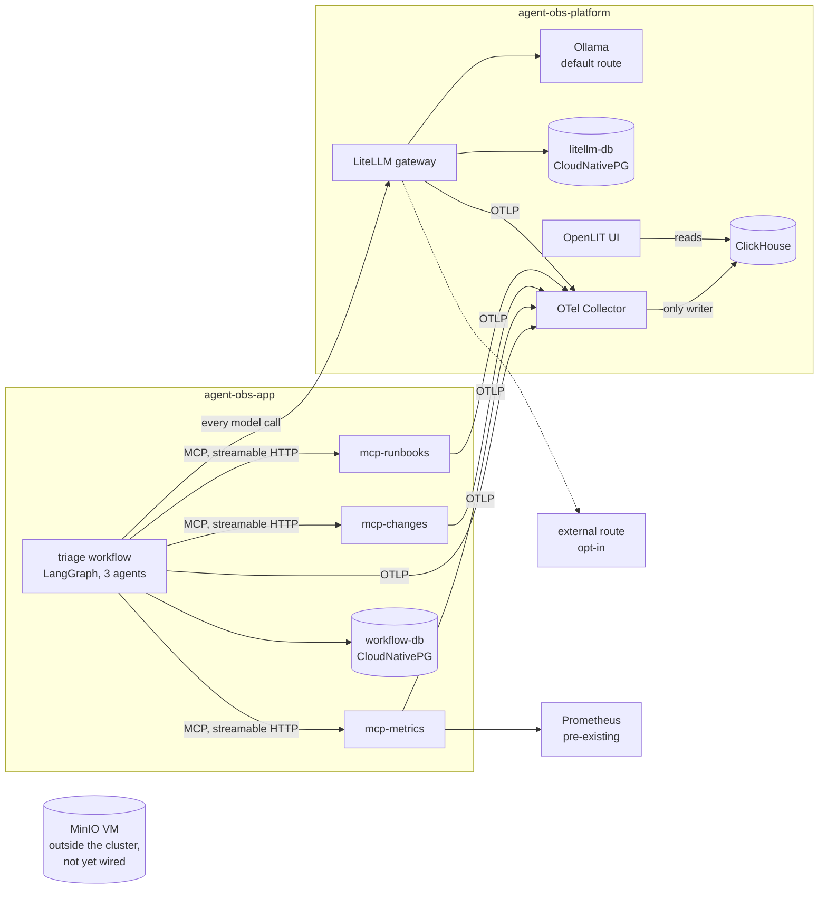

# Enterprise Agent Observability & Governance Lab

A self-hosted lab for tracing what AI agents actually do. A small multi-agent workflow,
three MCP tool servers and a model gateway, instrumented end to end with the OpenTelemetry
GenAI semantic conventions, running on Kubernetes.

The question this lab exists to answer is whether an agent platform can produce
**audit-grade traces without recording prompt or completion content**: what did the agent
do, on whose behalf, with what data access, and can you prove it later? Regulated
organisations often cannot store content, and still have to answer all four.

**Status: phase 1**, telemetry flowing end to end. Governance (phase 2) and dashboards
(phase 3) have not started. [LEARNINGS.md](LEARNINGS.md) is the running record of what was
built, why, and what broke; [CONTRIBUTIONS.md](CONTRIBUTIONS.md) logs the upstream gaps it
found; [TODO.md](TODO.md) is deferred work.

## What this deliberately is not

- **Not a product.** The workflow is a vehicle for telemetry. Model quality is not what is
  being demonstrated, and a 3B model on CPU is the default.
- **Not dependent on anything hosted.** The default model route is a self-hosted Ollama.
  An external OpenAI-compatible route is opt-in, added only when a key is present in `.env`.
- **Not a sandbox.** Nothing here isolates execution. The subject is visibility, attribution
  and access control, not confinement.
- **Not airtight.** Reasonably secure and fully auditable, not hardened against a determined
  adversary.
- **Not governed yet.** No virtual keys, budgets, guardrails, redaction or tail sampling:
  those are phase 2.
- **No Tempo, Grafana or LangFlow**, by choice. ClickHouse is the trace store, OpenLIT the
  phase 1 UI, and Perses is planned for dashboards.

## Architecture



The properties that matter, each established in LEARNINGS.md rather than assumed:

- **The Collector is the only thing that writes to ClickHouse.** OpenLIT reads the same
  `otel_traces` table, with its bundled ClickHouse and collector disabled. Phase 2 puts
  redaction, routing and sampling in the Collector, which only works if the Collector owns
  the write path.
- **Every model call goes through the gateway.** The workflow names a route (`local`,
  `remote`), never a model, so the gateway is the one place model access can be observed
  and, later, governed.
- **Trace context crosses the agent → tool boundary** because the `mcp` 2.x SDK propagates
  it over HTTP headers. MCP itself carries no trace context; a stdio transport would break
  the trace without a warning.
- **Content capture is off at every layer, explicitly.** The gateway runs with
  `no_content`. The workflow and tool servers set `capture_message_content=False`, because
  the OpenLIT SDK defaults it to `True`.
- **Attribution is per agent.** Each agent node records its own token usage (reasoning
  included), model-call count, finish reasons and an `ok` / `truncated` / `empty` outcome
  on its own span.

## Stack

| Layer | Component | Version |
| :- | :- | :- |
| Orchestration | LangGraph | 1.2.11 |
| Tools | MCP Python SDK, streamable HTTP | 2.2.0 |
| GenAI instrumentation | OpenLIT SDK | 1.45.0 |
| Model gateway | LiteLLM proxy | v1.100.0 |
| Default model | Ollama (CPU), `qwen2.5:3b` | 0.33.3 |
| Pipeline | OpenTelemetry Collector contrib | 0.159.0 (chart 0.172.1) |
| Hot store | ClickHouse | 25.8.33 |
| UI | OpenLIT | 1.24.0 |
| App state | PostgreSQL on CloudNativePG | 18.4 |
| Object storage | MinIO, standalone VM | RELEASE.2025-09-07T16-13-09Z |
| Runtime | Python | 3.12.14 |

Planned, not deployed: MLflow (phase 2), Perses (phase 3).

## Prerequisites

This repository builds the lab, not the cluster it runs on. It assumes:

- **Kubernetes** on amd64 nodes with a default StorageClass (tested: k3s v1.36,
  `local-path`).
- **CloudNativePG operator** (tested: 1.30.0).
- **Envoy Gateway** with a Gateway named `platform` in namespace `gateway`, listening on
  `*.kube.local`. Used only to expose the OpenLIT and LiteLLM UIs.
- **A container registry** the nodes can pull from (`10.1.1.240:5000` here).
- **An amd64 Docker host** reachable as Docker context `pve`, for image builds. Building
  on an arm64 workstation produces images that fail in the pod.
- **Prometheus** in the `observability` namespace, queried by the metrics tool server.
- **Optionally, a Proxmox VE host** with cloud-init template VM 9000, for `make minio`.
- Local tools: `kubectl`, `helm`, `uv`, `docker`, `python3`, `ssh`.

## Building it

```bash
cp .env.example .env          # every value has a working default except optional external keys
make minio                    # optional: MinIO VM on the Proxmox host
make step1                    # namespaces, secrets, ClickHouse, Collector, smoke trace
make step2                    # OpenLIT UI
make step3                    # Ollama and model pull, LiteLLM gateway and its database
make postgres                 # the workflow's state
make step5                    # build the MCP image, deploy the three tool servers, probe them
make workflow-image           # build the workflow image
make workflow-probe           # one-node plumbing proof
make workflow-triage          # a real run; INCIDENT= and ROUTE=local|remote override
```

`make help` lists every target. [deploy/README.md](deploy/README.md) covers deployment
order and reaching the UIs. Add `openlit.kube.local` and `litellm.kube.local` to your hosts
file, pointing at the Gateway's address.

## Checking it

| Command | Answers |
| :- | :- |
| `make smoke-trace` | Does the pipeline work, with no application involved? |
| `./scripts/gateway-trace.sh local` | Does the gateway join an incoming trace, and is content absent from every span? |
| `make mcp-probe` | Does each tool server answer MCP? |
| `make drift` | Does the cluster run what this repository describes? |

A trace is only complete if no span points at a parent that was never exported. This query
is what caught a span leak that dropped the link between every agent and its model calls:

```sql
SELECT count() FROM otel_traces
WHERE TraceId = '<trace id>' AND ParentSpanId != ''
  AND ParentSpanId NOT IN (SELECT SpanId FROM otel_traces WHERE TraceId = '<trace id>')
```

## Reproducibility

Rebuilding a commit reproduces its images:

- Python dependencies install `--frozen` from `apps/*/uv.lock`, and base images are pinned
  by digest. Third-party images are pinned by version.
- An image tag is the last commit that touched that image's inputs. A clean tag is built
  once and never rebuilt, so a tag names exactly one image. Uncommitted inputs produce a
  `-dirty` tag, which rebuilds and is pulled every time.
- Credentials live only in the gitignored `.env`, rendered into Kubernetes Secrets by
  `make secrets`.

## Layout

```
deploy/        numbered manifests and Helm values; the numbering is the deployment order
apps/workflow  the LangGraph triage workflow
apps/mcp       the three MCP tool servers (one image, three Deployments)
scripts/       build, tagging, probes and the drift check
docs/runbooks  the documents the runbooks tool server searches
```

## Licence

[Apache 2.0](LICENSE).
